<h1 align="center">
  
</h1>

<!-- <h5 align="center">
  <code>
    <a href="" title="Discord Profile"> Discord</a></code>
  <code><a href="" title="Telegram Profile"> Telegram</a></code>
  <code><a href="" title="Facebook Profile"> Facebook</a></code>
</h5> -->
 

### Hi there, I'm HeiTang! ฅ•ω•ฅ

> A Full-Stack Developer from Taiwan who loves building tools to automate life.  

* 📍 Based in **Taiwan**
  
* 🐍 **Pythonista** at heart, specializing in automation and scraping.
* 🛠️ **Builder** of practical tools like [MailCat](https://github.com/HeiTang/MailCat) and [AniCat](https://github.com/HeiTang/AniCat-v2).
* 🌱 **Currently exploring:** AI Agents, RAG System, and Dockerizing everything.

 

  
  

  <picture>
    <source media="(prefers-color-scheme: dark)" srcset="https://raw.githubusercontent.com/HeiTang/HeiTang/snake/github-contribution-grid-snake-dark.svg" />
    <source media="(prefers-color-scheme: light)" srcset="https://raw.githubusercontent.com/HeiTang/HeiTang/snake/github-contribution-grid-snake.svg" />
    
  </picture>

### ⚡ Stats ⚡

  
  

 

  

### 🔥 Repositories 🔥
 

  
  

  
  

 
<h4 align="center">
  <a href="https://github.com/HeiTang?tab=repositories" title="Show Repositories">🔎 Show More 🔍</a>
</h4>
